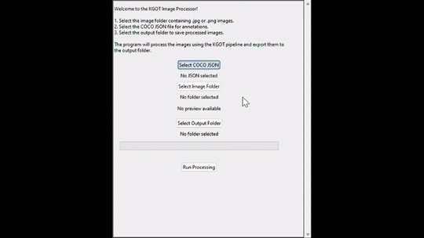

# Keypoint-Guided Ophidian Transformation (KGOT)

## **What is KGOT?**

KGOT (Keypoint-Guided Ophidian Transformation) is an image augmentation technique designed specifically for string-shaped objects, such as snakes. Unlike traditional methods, KGOT generates realistic, non-linear transformations by warping straightened objects into curved shapes guided by predefined keypoints. This approach ensures biologically plausible deformations while preserving critical features, making it useful for tasks such as snake individual identification and similar applications for string-shaped object classification. One of KGOT’s most powerful features lies in its potential to generate an infinite number of unique augmented images, provided that each set of keypoint paths is unique. This vast augmentation potential allows for the creation of extensive, diverse datasets from a limited number of original images.

---

## **Repository Overview**

This repository contains:

- **`data/`**: A folder containing the dataset used in our experiments.

  - `data/annotations`: JSON annotations for key points and binary masks for the snake images, which are essential for KGOT augmentation.
  - `data/orig`: The original snake images.
  - `data/orig_no_bg`: The original snake images with the background removed.
  - `data/trad_aug`: Images augmented using traditional augmentation methods (e.g., flipping, rotation, color changes).
  - `data/kgot_aug`: Images augmented using the KGOT algorithm.

- **`kgot_app/`**: The core implementation of the KGOT algorithm and an example app to try KGOT on your own data.
  - Includes the logic for KGOT, example input images, and JSON annotations.
  - Users can experiment with the KGOT algorithm by installing the requirements and running the app.

---

### **Overview of the methodology of KGOT augmentation**


KGOT transforms string-shaped objects by first detecting keypoints and straightening the object along its centerline for normalization. The straightened object is then warped into a curved shape using a scaled reference curve, guided by tangent and normal calculations. Finally, cracks inside the object are filled by the Telea inpainting algorithm to ensure the object's integrity.

---

## **Folder Structure**

The repository is organized as follows:

```plaintext
.
├── data/
│   ├── annotations/       # JSON annotations for key points and binary masks
│   ├── kgot/              # Images augmented by KGOT (used in experiments)
│   ├── orig/              # Original images
│   ├── orig_no_bg/        # Original images without background
│   ├── trad_aug/          # Images augmented using traditional methods
│
├── kgot_app/              # Implementation of the KGOT algorithm
│   ├── example/           # Example input image and JSON file for testing the app
│   ├── requirements.txt   # Python dependencies for KGOT
│   ├── application.py     # Main script to run the KGOT app
│   ├── utils/             # Utility functions for interpolation, pixel mapping, etc.
│
└── README.md              # Documentation
```

---

## **How to Use the KGOT App**

To try out KGOT on your own or example data:

### **1. Clone the Repository**

Clone this repository to your local machine:

```bash
git clone https://github.com/bkty1122/KGOT-image-augmentation
cd KGOT-image-augmentation/kgot_app
```

### **2. Install Dependencies**

Install the required Python libraries by running:

```bash
pip install -r requirements.txt
```

### **3. Run the App**

Run the KGOT application:

```bash
python app/main.py
```

An app named KGOT Image Processor will be prompted out. You can select the COCO JSON file and the folder of images to process, and the expected output folder for the augmented images. The example input image, JSON file and the expected output results are provided in the `kgot_app/example` folder.



---

## **Citing This Work**

If you use KGOT in your research or applications, please cite this repository:

```plaintext
@article{kwok2025kgot,
  title={Keypoint-Guided Ophidian Transformation for String-Shaped Data Augmentation},
  author={Tszyi Kwok, Brendan Park, Katharine Yagi, Anne Yagi, Chunsheng Yang, Min Liao, Yifeng Li},
  journal={Preprint},
  year={2025},
  note={Under review at ISMB/ECCB 2025},
  <!-- url={https://your-preprint-link-here} -->
}
```

This work is currently under review at ISMB/ECCB 2025. The citation will be updated if the paper is officially accepted.

---

## **Contact**

For any questions or issues, please feel free to open an issue on GitHub or contact the authors.

- **Author**: [Becky Kwok](https://bkty1122.github.io/)
- **Email**: p233340@hsu.edu.hk
